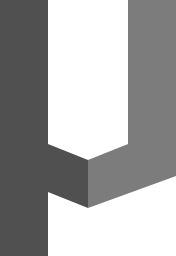

<p align="center">
    
</p>

<h1 align="center">
    nµa frontend
</h1>

Nordic Microalgae is a source of information about microalgae and related organisms in the Nordic area, i.e the Baltic Sea, the North East Atlantic and lakes, rivers and streams in the area. It is used for science, education, environmental monitoring etc. The content is mainly supplied by the users.

The application contains a taxonomical backbone, species sheets and images supplied by registered and approved contributors. Images can be searched for in a number of ways to make it easier to find alternatives when working with species indentification.

This repository contains source code for the Nordic Microalgae __user interface__.

## History

In 1996 the web site [Checklist of phytoplankton in the Skagerrak-Kattegat][checklist_of_phytoplankton] was launched by Bengt Karlson and Mats Kuylenstierna at Göteborg University, Sweden.

Most of the image content was produced using analogue video technique and the web pages were to a large extent produced using manual html-coding. Since then digital photography and digital video have become ubiquitous and technological advances in information technology can be used to share and disseminate information about marine organisms more efficiently.

In 2007 the inter-regional EU project Forum Skagerrak II provided initial funding for transferring the [Checklist of phytoplankton in the Skagerrak-Kattegat][checklist_of_phytoplankton] to modern web site technology. This site was never published officially due to lack of long term funding. The name was B-NEAT (Baltic and North East Atlantic Taxa).

## Codebase

The __user interface__ is written in JavaScript with the React and Redux libraries.

## How to run locally

Install project dependencies:

```
yarn install
```

Start webpack development server:

```
yarn run start
```

[checklist_of_phytoplankton]: http://www.smhi.se/oceanografi/oce_info_data/plankton_checklist/ssshome.htm
